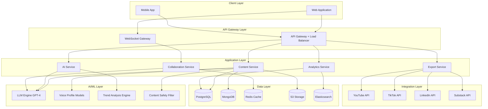

# Design Document: AI-Driven Content Creation Platform

## Overview

The AI-Driven Content Creation Platform is a cloud-native system that combines large language models, real-time collaboration infrastructure, and multi-platform publishing capabilities to empower content creators. The architecture prioritizes low-latency AI interactions, scalable collaborative sessions, and reliable content transformation pipelines.

### Key Design Principles

1. **AI-First Architecture**: Every feature leverages AI capabilities while maintaining human creative control
2. **Real-Time Collaboration**: WebSocket-based infrastructure enables spontaneous creative sessions
3. **Platform Agnostic**: Content transformation supports any target platform through adapter patterns
4. **Voice Preservation**: ML models capture and maintain creator authenticity across all generated content
5. **Safety by Default**: Multi-layer content filtering ensures compliance before publication

### Technology Stack

- **Backend**: Node.js/TypeScript with Express for API layer
- **AI/ML**: OpenAI GPT-4 for content generation, custom fine-tuned models for voice profiles
- **Real-Time**: WebSocket (Socket.io) for collaborative sessions
- **Database**: PostgreSQL for structured data, MongoDB for content assets, Redis for caching
- **Message Queue**: RabbitMQ for async content processing
- **Storage**: AWS S3 for media files
- **Search**: Elasticsearch for content discovery and trend analysis
- **Monitoring**: Prometheus + Grafana for metrics, Sentry for error tracking

## Architecture

### High-Level System Architecture



### Service Responsibilities

**Content Service**
- Manages content assets (scripts, videos, audio, text)
- Coordinates content transformation pipeline
- Handles version control and content history
- Manages workspace permissions and collaboration

**Collaboration Service**
- Manages real-time collaborative sessions via WebSocket
- Coordinates AI participation in brainstorming
- Handles session state and participant synchronization
- Generates session summaries and exports

**AI Service**
- Routes requests to appropriate AI models
- Manages prompt engineering and context injection
- Handles voice profile application
- Coordinates trend analysis and predictions

**Analytics Service**
- Aggregates engagement metrics from external platforms
- Performs performance analysis and recommendations
- Tracks content gaps and opportunities
- Generates predictive insights

**Export Service**
- Manages platform-specific formatting and export
- Handles OAuth flows for platform authentication
- Retries failed exports with exponential backoff
- Validates content against platform policies

## Components and Interfaces

### 1. AI Engine Component

The AI Engine is the core intelligence layer that powers content generation, voice consistency, and creative assistance.

#### Interfaces

```typescript
interface AIEngine {
  generateContent(request: ContentGenerationRequest): Promise<GeneratedContent>;
  analyzeVoice(samples: ContentAsset[]): Promise<VoiceProfile>;
  applyVoiceProfile(content: string, profile: VoiceProfile): Promise<string>;
  suggestTopics(context: TopicContext): Promise<TopicSuggestion[]>;
  optimizeForPlatform(content: string, platform: Platform): Promise<OptimizedContent>;
}

interface ContentGenerationRequest {
  briefId: string;
  contentType: ContentType;
  voiceProfileId?: string;
  targetPlatform?: Platform;
  constraints: ContentConstraints;
}

interface GeneratedContent {
  content: string;
  metadata: ContentMetadata;
  voiceConsistencyScore: number;
  safetyFlags: SafetyFlag[];
}

interface VoiceProfile {
  id: string;
  creatorId: string;
  vocabulary: Map<string, number>;
  sentencePatterns: SentencePattern[];
  tonalCharacteristics: TonalProfile;
  consistencyThreshold: number;
}

interface TopicSuggestion {
  topic: string;
  relevanceScore: number;
  crossGenreConnections: string[];
  freshAngle: string;
  similarityToExisting: number;
}
```

#### Implementation Details

**Content Generation Flow**:
1. Receive generation request with content brief
2. Load voice profile if specified
3. Construct prompt with voice characteristics and constraints
4. Call LLM API (GPT-4) with temperature=0.7 for creativity
5. Apply voice profile post-processing for consistency
6. Run safety filter on generated content
7. Calculate voice consistency score
8. Return generated content with metadata

**Voice Profile Learning**:
1. Analyze minimum 10 content samples from creator
2. Extract vocabulary frequency distribution
3. Identify sentence structure patterns (avg length, complexity)
4. Analyze tonal characteristics (formal/casual, technical/accessible)
5. Train lightweight fine-tuning layer on creator samples
6. Store profile with 90%+ consistency threshold

**Topic Discovery Algorithm**:
1. Query trend analysis engine for emerging topics
2. Analyze creator's previous 50 content assets
3. Calculate similarity scores using embedding vectors
4. Filter topics with similarity < 85%
5. Identify cross-genre connections via topic clustering
6. Rank by relevance score (trend velocity × audience alignment)
7. Return top 10 unique suggestions

### 2. Real-Time Collaboration Component

The Collaboration Component enables synchronous brainstorming sessions with AI participation, maintaining low latency and session context.

#### Interfaces

```typescript
interface CollaborationService {
  createSession(config: SessionConfig): Promise<Session>;
  joinSession(sessionId: string, participant: Participant): Promise<void>;
  contributeIdea(sessionId: string, idea: Idea): Promise<void>;
  requestAISuggestion(sessionId: string, context: string): Promise<AISuggestion>;
  voteOnIdea(sessionId: string, ideaId: string, vote: Vote): Promise<void>;
  endSession(sessionId: string): Promise<SessionSummary>;
}

interface Session {
  id: string;
  workspaceId: string;
  participants: Participant[];
  ideas: Idea[];
  aiContributions: AISuggestion[];
  startTime: Date;
  status: SessionStatus;
}

interface Participant {
  userId: string;
  role: ParticipantRole;
  joinedAt: Date;
  isActive: boolean;
}

interface Idea {
  id: string;
  contributorId: string;
  content: string;
  timestamp: Date;
  votes: Vote[];
  aiReferences: string[];
}

interface AISuggestion {
  id: string;
  content: string;
  referencedIdeas: string[];
  confidence: number;
  timestamp: Date;
}

interface SessionSummary {
  sessionId: string;
  duration: number;
  totalIdeas: number;
  topRatedIdeas: Idea[];
  aiContributions: number;
  actionItems: ActionItem[];
  contentBrief: ContentBrief;
}
```

#### Implementation Details

**Session Management**:
- Use Redis for session state storage (TTL: 24 hours)
- WebSocket connections managed via Socket.io rooms
- Maximum 10 human participants + AI per session
- Heartbeat every 30 seconds to detect disconnections
- Automatic reconnection with state recovery

**AI Participation Flow**:
1. Monitor session ideas in real-time via WebSocket
2. Maintain sliding window of last 10 contributions
3. When AI suggestion requested or auto-triggered (every 5 ideas):
   - Build context from recent contributions
   - Generate suggestion referencing 3+ previous ideas
   - Return within 2-second SLA
4. Track AI contribution count and quality scores
5. Adjust AI participation frequency based on session velocity

**Consensus Tracking**:
- Real-time vote aggregation using Redis sorted sets
- Broadcast vote updates to all participants via WebSocket
- Highlight top 3 ideas with vote counts
- Calculate consensus score: (top_votes / total_participants)

**Session Summary Generation**:
1. Collect all ideas and AI contributions
2. Identify top-rated ideas (vote count > 50% participants)
3. Extract action items using NLP (imperative sentences)
4. Generate structured content brief from session context
5. Store summary in MongoDB
6. Send summary to all participants via email

### 3. Content Transformation Pipeline

The Transformation Pipeline converts content between formats while preserving meaning, structure, and creator voice.

#### Interfaces

```typescript
interface TransformationPipeline {
  transform(asset: ContentAsset, targetFormat: ContentFormat): Promise<TransformedContent>;
  batchTransform(asset: ContentAsset, formats: ContentFormat[]): Promise<TransformedContent[]>;
  validateTransformation(original: ContentAsset, transformed: TransformedContent): Promise<ValidationResult>;
}

interface ContentAsset {
  id: string;
  creatorId: string;
  format: ContentFormat;
  content: string | Buffer;
  metadata: ContentMetadata;
  voiceProfileId?: string;
}

interface TransformedContent {
  originalAssetId: string;
  format: ContentFormat;
  content: string | Buffer;
  preservationScore: number;
  platformOptimizations: PlatformOptimization[];
}

interface ContentFormat {
  type: FormatType; // podcast, newsletter, social_post, video_script
  platform?: Platform;
  constraints: FormatConstraints;
}

interface FormatConstraints {
  maxLength?: number;
  minLength?: number;
  structureRequirements?: string[];
  accessibilityRequirements?: string[];
}
```

#### Implementation Details

**Transformation Strategies**:

**Podcast → Newsletter**:
1. Transcribe audio using Whisper API if not already text
2. Identify key segments using sentence embeddings
3. Extract quotes and main points
4. Generate written narrative preserving flow
5. Add section headers and formatting
6. Include embedded audio player links
7. Generate alt text for any images

**Long-Form → Social Media**:
1. Identify core message using extractive summarization
2. Generate 5 platform-specific variants:
   - Twitter/X: 280 chars, hashtags, thread structure
   - LinkedIn: Professional tone, 1300 chars, document format
   - TikTok: Hook + 15-60s script, trending audio suggestions
   - Instagram: Visual-first caption, emoji usage
   - Facebook: Conversational tone, engagement questions
3. Preserve key quotes and CTAs
4. Apply platform-specific best practices

**Accessibility Enhancements**:
- Generate alt text for all images using vision models
- Create transcripts for audio/video content
- Add captions with proper timing
- Ensure WCAG 2.1 AA compliance for text contrast
- Provide audio descriptions for visual content

**Quality Validation**:
- Calculate semantic similarity between original and transformed (target: >85%)
- Verify voice consistency if voice profile applied
- Check format constraints compliance
- Validate accessibility requirements
- Run safety filter on transformed content

### 4. Voice Profile System

The Voice Profile System learns and maintains creator authenticity across all AI-generated content.

#### Interfaces

```typescript
interface VoiceProfileSystem {
  createProfile(creatorId: string, samples: ContentAsset[]): Promise<VoiceProfile>;
  updateProfile(profileId: string, newSamples: ContentAsset[]): Promise<VoiceProfile>;
  analyzeConsistency(content: string, profileId: string): Promise<ConsistencyScore>;
  applyProfile(content: string, profileId: string): Promise<string>;
}

interface VoiceProfile {
  id: string;
  creatorId: string;
  version: number;
  createdAt: Date;
  updatedAt: Date;
  
  // Linguistic features
  vocabularyDistribution: Map<string, number>;
  sentenceStructure: SentenceMetrics;
  paragraphPatterns: ParagraphMetrics;
  
  // Stylistic features
  tonalProfile: TonalCharacteristics;
  formalityScore: number;
  technicalityScore: number;
  emotionalRange: EmotionalProfile;
  
  // Fine-tuning
  fineTunedModelId?: string;
  consistencyThreshold: number;
}

interface ConsistencyScore {
  overallScore: number;
  vocabularyMatch: number;
  structureMatch: number;
  toneMatch: number;
  recommendations: string[];
}
```

#### Implementation Details

**Profile Creation Process**:
1. Require minimum 10 content samples (5000+ words total)
2. Tokenize and analyze vocabulary:
   - Word frequency distribution
   - Unique word ratio
   - Technical term usage
   - Idiom and phrase patterns
3. Analyze sentence structure:
   - Average sentence length
   - Complexity score (subordinate clauses)
   - Punctuation patterns
   - Transition word usage
4. Extract tonal characteristics:
   - Formality score (0-100)
   - Technical density
   - Emotional valence
   - Humor indicators
5. Create fine-tuning dataset from samples
6. Fine-tune GPT-3.5 on creator samples (cost-effective)
7. Store profile with 90% consistency threshold

**Consistency Analysis**:
1. Tokenize generated content
2. Compare vocabulary distribution (KL divergence)
3. Analyze sentence structure similarity
4. Calculate tonal alignment score
5. Compute weighted overall score:
   - Vocabulary: 40%
   - Structure: 30%
   - Tone: 30%
6. If score < 90%, generate recommendations:
   - "Use more technical terms like [examples]"
   - "Shorten average sentence length"
   - "Increase casual tone with contractions"

**Profile Application**:
1. Load voice profile and fine-tuned model
2. Inject voice characteristics into system prompt
3. Use fine-tuned model for generation
4. Post-process output to enforce vocabulary patterns
5. Validate consistency score
6. If score < 90%, regenerate with stronger constraints

### 5. Trend Analysis Engine

The Trend Analysis Engine monitors multiple data sources to identify emerging topics and predict content opportunities.

#### Interfaces

```typescript
interface TrendAnalysisEngine {
  analyzeTrends(timeWindow: TimeWindow): Promise<Trend[]>;
  predictTrendLongevity(trendId: string): Promise<TrendPrediction>;
  identifyContentGaps(creatorId: string): Promise<ContentGap[]>;
  matchTrendsToCreator(creatorId: string): Promise<TrendMatch[]>;
}

interface Trend {
  id: string;
  topic: string;
  velocity: number; // growth rate
  currentVolume: number;
  sources: TrendSource[];
  relatedTopics: string[];
  detectedAt: Date;
  peakPrediction: Date;
}

interface TrendPrediction {
  trendId: string;
  expectedDuration: DurationRange;
  confidence: number;
  saturationRisk: number;
  recommendedActionWindow: TimeWindow;
}

interface ContentGap {
  topic: string;
  audienceDemand: number;
  currentSupply: number;
  gapScore: number;
  suggestedAngles: string[];
}

interface TrendMatch {
  trend: Trend;
  alignmentScore: number;
  voiceProfileMatch: number;
  contentAngles: string[];
  urgency: UrgencyLevel;
}
```

#### Implementation Details

**Data Source Monitoring**:
- Twitter/X API: Track trending hashtags and topics
- Google Trends API: Monitor search volume changes
- Reddit API: Analyze subreddit activity and upvotes
- YouTube API: Track video view velocity
- News APIs: Aggregate headlines from 50+ sources
- TikTok: Monitor trending sounds and hashtags
- Update frequency: Every 15 minutes

**Trend Detection Algorithm**:
1. Collect topic mentions across all sources
2. Calculate velocity: (current_volume - previous_volume) / time_delta
3. Identify topics with velocity > 2 standard deviations
4. Cluster related topics using embedding similarity
5. Calculate trend score: velocity × volume × source_diversity
6. Filter noise: require presence in 3+ sources
7. Store trends in Elasticsearch with time-series data

**Longevity Prediction**:
1. Analyze historical patterns for similar topics
2. Calculate saturation indicators:
   - Content creation rate
   - Engagement rate decline
   - Source diversity decrease
3. Apply time-series forecasting (ARIMA model)
4. Predict peak date and decline curve
5. Calculate confidence based on historical accuracy
6. Recommend action window: before 50% saturation

**Content Gap Analysis**:
1. Query creator's published content (last 90 days)
2. Analyze audience engagement patterns
3. Identify high-engagement topics
4. Compare with current trend landscape
5. Calculate gap score: (demand - supply) × audience_alignment
6. Suggest unexplored angles using topic clustering
7. Rank gaps by opportunity score

**Creator-Trend Matching**:
1. Load creator's voice profile and content history
2. Calculate topic alignment using embedding similarity
3. Score voice profile compatibility
4. Assess audience overlap
5. Calculate urgency based on trend velocity
6. Notify creator if alignment > 80% and urgency high
7. Provide 3+ content angle suggestions

### 6. Content Safety Filter

The Safety Filter ensures all content meets platform policies, legal requirements, and ethical standards before publication.

#### Interfaces

```typescript
interface ContentSafetyFilter {
  scanContent(content: ContentAsset): Promise<SafetyReport>;
  validateCompliance(content: ContentAsset, regulations: Regulation[]): Promise<ComplianceReport>;
  flagForReview(content: ContentAsset, reason: string): Promise<ReviewTicket>;
  checkPlatformPolicy(content: ContentAsset, platform: Platform): Promise<PolicyCheck>;
}

interface SafetyReport {
  contentId: string;
  overallRisk: RiskLevel;
  flags: SafetyFlag[];
  recommendations: string[];
  requiresHumanReview: boolean;
}

interface SafetyFlag {
  type: FlagType; // hate_speech, violence, explicit, misinformation, etc.
  severity: Severity;
  location: ContentLocation;
  explanation: string;
  confidence: number;
}

interface ComplianceReport {
  contentId: string;
  regulations: RegulationCheck[];
  compliant: boolean;
  violations: Violation[];
  requiredActions: string[];
}

interface PolicyCheck {
  platform: Platform;
  compliant: boolean;
  violations: PolicyViolation[];
  warnings: PolicyWarning[];
}
```

#### Implementation Details

**Multi-Layer Filtering**:

**Layer 1: Keyword Blocklist**
- Maintain blocklist of prohibited terms (updated weekly)
- Fast regex matching for immediate rejection
- Language-specific blocklists for all 10 supported languages
- Response time: <100ms

**Layer 2: ML Classification**
- Use OpenAI Moderation API for hate speech, violence, explicit content
- Custom fine-tuned model for misinformation detection
- Sentiment analysis for tone appropriateness
- Response time: <2 seconds
- Accuracy target: 95%+

**Layer 3: Contextual Analysis**
- Analyze content in full context (not just keywords)
- Detect subtle policy violations (dogwhistles, coded language)
- Check factual claims against knowledge base
- Flag claims requiring fact-checking
- Response time: <5 seconds

**Layer 4: Human Review Queue**
- Content flagged with confidence < 90% goes to review
- Priority queue based on severity
- SLA: 48-hour response time
- Reviewers can approve, reject, or request edits
- Appeal mechanism for rejected content

**Platform-Specific Validation**:
- YouTube: Check community guidelines, copyright, advertiser-friendly
- TikTok: Validate against community guidelines, music licensing
- LinkedIn: Professional standards, no explicit content
- Substack: Minimal restrictions, focus on legal compliance

**Compliance Checking**:
- GDPR: Verify consent for personal data, right to deletion
- CCPA: Check opt-out mechanisms, data disclosure
- COPPA: Age verification for child-directed content
- Regional regulations: Country-specific content restrictions

**Safety Scoring**:
```
Risk Score = (
  hate_speech_score × 0.3 +
  violence_score × 0.25 +
  explicit_score × 0.2 +
  misinformation_score × 0.15 +
  policy_violation_score × 0.1
)

If Risk Score > 0.7: Block content
If Risk Score 0.4-0.7: Flag for review
If Risk Score < 0.4: Approve with warnings if any
```

### 7. Export and Integration Service

The Export Service handles platform-specific formatting, authentication, and publishing to external platforms.

#### Interfaces

```typescript
interface ExportService {
  exportContent(assetId: string, platform: Platform, options: ExportOptions): Promise<ExportResult>;
  validateExport(assetId: string, platform: Platform): Promise<ValidationResult>;
  scheduleExport(assetId: string, platform: Platform, publishTime: Date): Promise<ScheduledExport>;
  retryFailedExport(exportId: string): Promise<ExportResult>;
}

interface ExportOptions {
  platformSpecific: Record<string, any>;
  scheduling?: SchedulingOptions;
  notifications?: NotificationPreferences;
}

interface ExportResult {
  exportId: string;
  platform: Platform;
  status: ExportStatus;
  platformUrl?: string;
  error?: ExportError;
  metadata: ExportMetadata;
}

interface PlatformAdapter {
  authenticate(credentials: PlatformCredentials): Promise<AuthToken>;
  formatContent(asset: ContentAsset): Promise<PlatformContent>;
  publish(content: PlatformContent): Promise<PublishResult>;
  validatePolicy(content: PlatformContent): Promise<PolicyCheck>;
}
```

#### Implementation Details

**Platform Adapter Pattern**:
Each platform has a dedicated adapter implementing the PlatformAdapter interface:

**YouTube Adapter**:
```typescript
class YouTubeAdapter implements PlatformAdapter {
  async formatContent(asset: ContentAsset): Promise<YouTubeContent> {
    return {
      title: this.optimizeTitle(asset.metadata.title, 100),
      description: this.formatDescription(asset.content, 5000),
      tags: this.generateTags(asset.metadata.keywords, 500),
      categoryId: this.selectCategory(asset.metadata.genre),
      thumbnails: this.generateThumbnailRecommendations(asset),
      chapters: this.extractTimestamps(asset.content),
      privacyStatus: 'public',
      madeForKids: false
    };
  }
  
  async publish(content: YouTubeContent): Promise<PublishResult> {
    // Upload video file to YouTube
    // Set metadata
    // Return video URL
  }
}
```

**TikTok Adapter**:
```typescript
class TikTokAdapter implements PlatformAdapter {
  async formatContent(asset: ContentAsset): Promise<TikTokContent> {
    return {
      video: this.ensureVerticalFormat(asset.content),
      caption: this.optimizeCaption(asset.metadata.description, 150),
      hashtags: this.selectTrendingHashtags(asset.metadata.keywords, 5),
      sound: this.suggestTrendingAudio(asset.metadata.genre),
      coverImage: this.extractCoverFrame(asset.content, 1.5),
      allowComments: true,
      allowDuet: true,
      allowStitch: true
    };
  }
}
```

**LinkedIn Adapter**:
```typescript
class LinkedInAdapter implements PlatformAdapter {
  async formatContent(asset: ContentAsset): Promise<LinkedInContent> {
    return {
      text: this.formatProfessionalPost(asset.content, 3000),
      media: this.prepareMediaAttachments(asset),
      article: this.convertToArticle(asset), // if long-form
      hashtags: this.selectProfessionalHashtags(asset.metadata.keywords),
      visibility: 'PUBLIC'
    };
  }
}
```

**Substack Adapter**:
```typescript
class SubstackAdapter implements PlatformAdapter {
  async formatContent(asset: ContentAsset): Promise<SubstackContent> {
    return {
      title: asset.metadata.title,
      subtitle: asset.metadata.subtitle,
      body: this.formatHTML(asset.content),
      coverImage: asset.metadata.coverImage,
      sendAsEmail: true,
      freeOrPaid: 'free',
      publishedAt: new Date()
    };
  }
}
```

**Export Flow**:
1. Validate content asset exists and is complete
2. Run safety filter and platform policy check
3. Select appropriate platform adapter
4. Authenticate with platform (OAuth 2.0)
5. Format content for platform
6. Validate formatted content
7. Publish to platform
8. Store platform URL and metadata
9. Update content asset with export status
10. Send notification to creator

**Error Handling and Retries**:
- Exponential backoff: 1s, 2s, 4s, 8s, 16s
- Maximum 5 retry attempts
- Specific error handling:
  - Rate limit: Wait for reset time
  - Auth failure: Prompt re-authentication
  - Content policy violation: Return detailed error
  - Network timeout: Retry immediately
- Failed exports stored in queue for manual review

**Scheduling**:
- Store scheduled exports in PostgreSQL
- Cron job checks every minute for due exports
- Execute export at scheduled time (±2 minutes)
- Handle timezone conversions
- Send reminder 1 hour before publish

## Data Models

### Core Entities

```typescript
// User and Workspace
interface User {
  id: string;
  email: string;
  name: string;
  createdAt: Date;
  subscription: SubscriptionTier;
  preferences: UserPreferences;
}

interface Workspace {
  id: string;
  name: string;
  ownerId: string;
  members: WorkspaceMember[];
  createdAt: Date;
  settings: WorkspaceSettings;
}

interface WorkspaceMember {
  userId: string;
  role: Role; // Owner, Editor, Contributor, Viewer
  joinedAt: Date;
  permissions: Permission[];
}

// Content Assets
interface ContentAsset {
  id: string;
  workspaceId: string;
  creatorId: string;
  title: string;
  format: ContentFormat;
  content: string | Buffer;
  metadata: ContentMetadata;
  voiceProfileId?: string;
  status: ContentStatus;
  version: number;
  createdAt: Date;
  updatedAt: Date;
  publishedAt?: Date;
}

interface ContentMetadata {
  description: string;
  keywords: string[];
  genre: string;
  targetAudience: string;
  duration?: number;
  wordCount?: number;
  language: string;
  coverImage?: string;
}

// Voice Profiles
interface VoiceProfile {
  id: string;
  creatorId: string;
  name: string;
  version: number;
  sampleAssetIds: string[];
  linguisticFeatures: LinguisticFeatures;
  stylisticFeatures: StylisticFeatures;
  fineTunedModelId?: string;
  consistencyThreshold: number;
  createdAt: Date;
  updatedAt: Date;
}

interface LinguisticFeatures {
  vocabularyDistribution: Record<string, number>;
  avgSentenceLength: number;
  sentenceComplexity: number;
  paragraphLength: number;
  transitionWords: string[];
}

interface StylisticFeatures {
  formalityScore: number;
  technicalityScore: number;
  emotionalValence: number;
  humorIndicators: string[];
  idioms: string[];
}

// Collaborative Sessions
interface CollaborativeSession {
  id: string;
  workspaceId: string;
  initiatorId: string;
  participants: SessionParticipant[];
  ideas: SessionIdea[];
  aiContributions: AIContribution[];
  status: SessionStatus;
  startTime: Date;
  endTime?: Date;
  summaryId?: string;
}

interface SessionParticipant {
  userId: string;
  joinedAt: Date;
  leftAt?: Date;
  contributionCount: number;
  voteCount: number;
}

interface SessionIdea {
  id: string;
  contributorId: string;
  content: string;
  timestamp: Date;
  votes: Vote[];
  tags: string[];
}

interface AIContribution {
  id: string;
  content: string;
  referencedIdeaIds: string[];
  confidence: number;
  timestamp: Date;
  feedback?: Feedback;
}

// Trends and Analytics
interface Trend {
  id: string;
  topic: string;
  velocity: number;
  volume: number;
  sources: TrendSource[];
  relatedTopics: string[];
  detectedAt: Date;
  peakPrediction?: Date;
  status: TrendStatus;
}

interface TrendSource {
  platform: string;
  url: string;
  mentions: number;
  timestamp: Date;
}

interface ContentGap {
  id: string;
  topic: string;
  audienceDemand: number;
  currentSupply: number;
  gapScore: number;
  suggestedAngles: string[];
  identifiedAt: Date;
  expiresAt: Date;
}

// Exports and Publishing
interface Export {
  id: string;
  contentAssetId: string;
  platform: Platform;
  status: ExportStatus;
  platformUrl?: string;
  scheduledFor?: Date;
  publishedAt?: Date;
  error?: ExportError;
  retryCount: number;
  metadata: ExportMetadata;
}

interface ExportMetadata {
  platformSpecific: Record<string, any>;
  engagementMetrics?: EngagementMetrics;
  lastSyncedAt?: Date;
}

interface EngagementMetrics {
  views: number;
  likes: number;
  comments: number;
  shares: number;
  clickThroughRate?: number;
  watchTime?: number;
  syncedAt: Date;
}
```

### Database Schema Design

**PostgreSQL Tables** (Structured, relational data):
- users
- workspaces
- workspace_members
- voice_profiles
- collaborative_sessions
- session_participants
- exports
- trends
- content_gaps

**MongoDB Collections** (Flexible, document data):
- content_assets
- session_ideas
- ai_contributions
- session_summaries
- content_briefs

**Redis Data Structures** (Cache, real-time):
- Session state: Hash (session:{id})
- Active participants: Set (session:{id}:participants)
- Idea votes: Sorted Set (session:{id}:votes)
- Rate limiting: String with TTL (ratelimit:{userId})
- Voice profile cache: Hash (voiceprofile:{id})

**Elasticsearch Indices**:
- content_assets (full-text search)
- trends (time-series analysis)
- engagement_metrics (analytics queries)

## 